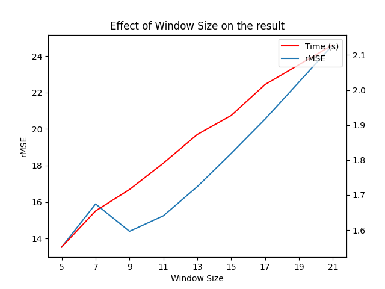
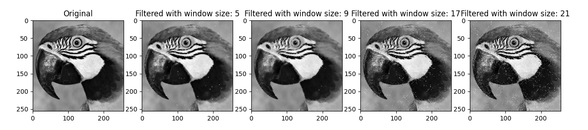
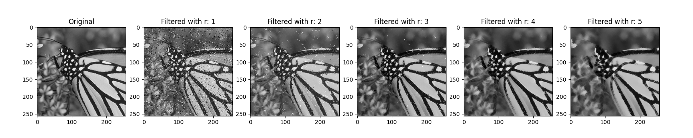

## Generalize max/median filter

#### Introduction

This repository is an implementation of generalize max/median filter proposed by [Zou Y. et al.](https://ieeexplore.ieee.org/document/647798) in Python. This is our final assignment at VNU-UET's courses: INT3404 -  Image Processing in 2024 fall semester.

#### Authors

- Nguyen Duy Hung, 21020436, VNU-UET Computer Engineering Student, Class of 2025.
- Nguyen Thanh An, 21020886, VNU-UET Computer Engineering Student, Class of 2025.
- Nguyen Thu Hien, 21020141, VNU-UET Computer Engineering Student, Class of 2025.

#### Running the filter

The following command runs the filter on the image `Lenna.png` with a custom setting, we assume that the image is stored in the `images` folder.

```
python3 eval.py --image images/Lenna.png
                --window_size 5
                --noise_type s&p
                --noise_ratio 0.1
```

For more information about the arguments, please run `python3 eval.py --help`.

To run the evaluation on the Set12 dataset, please run `python3 eval_set12.py`. The results will be stored in the `results` folder.

#### Theoretical basis
The generalized max/median filter is described by following algorithm:

- $x(. , . )$ is a two-dimensional sequence of an image with $x(i,j)$ is the $(i,j)^{th}$
pixel.
- $W(i,j)$ is a $(2n + 1) × (2n + 1)$ square window centered at the $(i,j)^{th}$ pixel. We define 
the following line segments of $W$: $W_k(i,j), (1 ≤ k ≤ 4)$ as:
    - $W_1(i,j) = \{x(i, j + k), −n ≤ k ≤ n, l ≠ 0\}$
    - $W_2(i,j) = \{x(i + k, j + k), −n ≤ k ≤ n, k ≠ 0\}$
    - $W_3(i,j) = \{x(i + k, j), −n ≤ k ≤ n, k ≠ 0\}$
    - $W_4(i,j) = \{x(i − k, j + k), −n ≤ k ≤ n, k ≠ 0\}$
- Let $x_{(1)}^k(i,j) ≤ x_{(2)}^k(i,j) ≤ ⋯ ≤ x_{(2n + 1)}^k(i,j)$ be the order statistics in $W_k(i,j)$, and the $r^th$ largest value $x_{(r)}^k(i,j)$ in $W_k(i,j)$ is denoted by $x_{(r)}^k(i,j)$.will be selected.
- The output of generalized max/median filtering is defined as: $y(i,j) = med(S_1(i,j), S_2(i,j),x(i,j))$ where:
    - $S_1(i,j) = \{x_{(r)}^k(i,j), 1 ≤ k ≤ 4\}$
    - $S_2(i,j) = \{x_{(2n-r+1)}^k(i,j), 1 ≤ k ≤ 4\}$
- When $r = n + 1$, the generalized max/median filter is equivalent to the median filter. When $r = 1$, the generalized max/median filter is identical to the max/median filter.

#### Results
The following figures show the results of the generalized max/median filter on an image in the Set12 dataset in three different noise settings: Without noise, with salt and pepper noise, and with Gaussian noise.


Other results can be found in the `results` folder.

We also calculate the rMSE of the results compared to the original images on different window sizes and r values. The results are shown in the following charts and figures.



